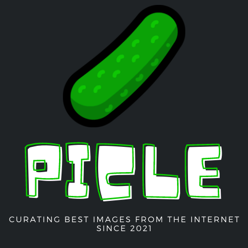

<p align="center">
  
</p>
<p align="center">
  <h1 align="center">PICLE</h1>
  <p align="center">
  An image search app that lets you search over 2.4 million+ high quality stock images
  </p>
</p>
<details open="open">
  <summary><h2 style="display: inline-block">Table of Contents</h2></summary>
  <ol>
    <li><a href="#about-the-project">About The Project</a></li>
    <li><a href="#tech-stack">Tech Stack</a></li>
    <li><a href="#getting-started">Getting Started</a></li>
    <li><a href="#developers">Developers</a></li>
  </ol>
</details>

## About The Project
  
  
## App Link (Signed APK | Downloadable)
Picle: [PICLE APK](https://drive.google.com/file/d/1PRDNYsJVVQiva5lgFEI6dTS5wEMRZOEB/view?usp=sharing)

### Screens
**Search** - Debounced Search Bar which invokes a Grid list on response<br/>
**Details** - Tags, Resolution, uploader's Username and Avatar Image <br/>
**About** - A brief intro of the app conveyed thorugh it's logo   <br/>

### Notable Features
**Orientation** - Auto adjusts it's grid layout, based on orientation (potrait and landscape)<br/>
**Infinite Scroll** - Users can scroll down the image list infinitely.<br/>
**Scroll Position Retention** - Retains it's place even after changing orientation or going out of the 'Search Screen' <br/>
**Combination of Stack and Tab Navigators** - Consists of nested navigation <br/>

## Tech Stack
- [React Native](https://reactnative.dev/)
- [Redux](https://redux.js.org/)
- [React Navigation](https://reactnavigation.org/)

## External API
- [Pixabay](https://pixabay.com/api/docs/)

<!-- GETTING STARTED -->
## Getting Started
To get a local copy up and running follow these simple steps.
These steps are for users running a MAC and Android setup.
For any other environments please take help from - [React Native Official Docs](https://reactnative.dev/docs/environment-setup)

### Prerequisites
- npm
  ```sh
  brew install node
  ```
- watchman
  ```sh
  brew install watchman
  ```
- Java Development Kit
  ```sh
  brew install --cask adoptopenjdk/openjdk/adoptopenjdk8
  ```
- [Android development environment](https://reactnative.dev/docs/environment-setup)

If you have already installed Node on your system, make sure it is Node 12 or newer.

### Installation
1. Clone this repo
   ```sh
   git clone https://github.com/amanajmani/picle.git
   ```
2. Install NPM package
   ```sh
   npm install
   ```
3. Create a [Pixabay Account](https://pixabay.com/api/docs/) in order to use their free API and get your API key
4. Create and add a `.env` file in the root of the project and paste
   ```sh
   PIXABAY_API_KEY= // Your 'API Key' goes here (no quotes)
   ```
5. Run the application
    ```sh
    npx react-native start
    npx react-native run-android
    ```

## Developers
- [Aman Ajmani](https://github.com/amanajmani)

